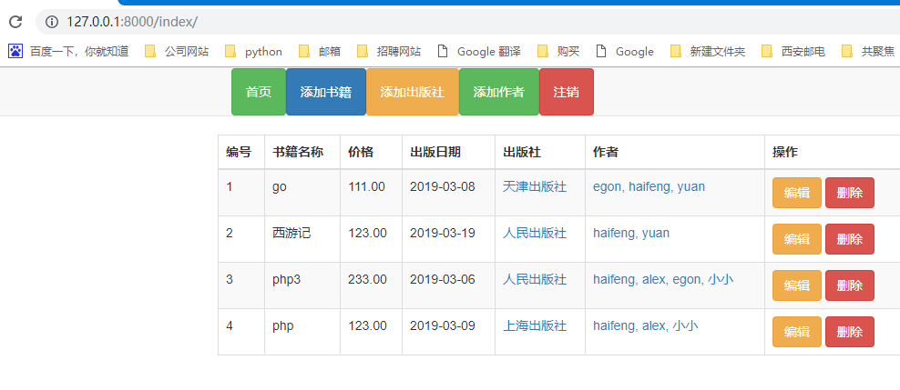

开发环境
    Python (3.6.1)
    Django (1.11)
    Drf (3.9.0)

生成表结构
    python manage.py makemigrations
    python manage.py migrate

启动项目
python manage.py runserver 0.0.0.0:9000
访问首页示例

实现功能
    1. 实现用户登录、注册
    2. 列出图书列表、出版社列表、作者列表
    3. 点击作者，会在新的页面列出该作者出版的图书列表
    4. 点击出版社，会列出该出版社旗下图书列表
    5. 可以创建、修改、删除 图书、作者、出版社
